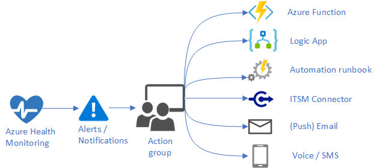

# Alerts & Monitoring

Goal: Understand the basics of cloud alerts and monitoring.

# Core Concepts

## Monitoring


Things that you will need to monitor:

- **Performance** - this is things like memory, response time, latency, load
- **Reliability** - uptime (via liveness), time between failures, time to repair, errors
- **Security** - DDOS, access controls, auth failures, data security
- **Costs** - predicted vs actuals

Every single deployed artifact needs to capture the data necessary to monitor against these perspectives.  

### Types of Monitoring
It is impractical to try and monitor all aspects of your cloud in one dashboard.  Typically recommend creating a view for a specific persona to access the data that they want to see.  This will be driven by your needs and your specific personas.  Normally we will create a dashboard per persona:


- **Application/System Performance** This would be geared towards a product owner or administrator to help them see how the overall application is performing (response time, uptime, security issues, etc)
- **Data** - this would be geared towards data engineers and persistance layers.  It will help to monitor persistance, HA, replication, access controls, costs, etc
- **Networks** - This will be heavily geared for network admins who are monitoring traffic, DDOS, Firewalls, IP addresses, Security concerns, anomalies, etc
- **Virtual Machines** - This will monitor vm metrics for performance, reliability, security, etc
- **Orchestration** - If containerization is a part of your cloud environment then a dashboard showing the health of your clusters, nodes, containers, networks, etc is critical

### Best Practices

- **Monitoring is for diagnosing** - monitoring is a powerful tool to gain visibility, not to resolve issues.
- **Use Automation To Enforce Standards** - It is very important that your Policies or your CI/CD pipeline will enforce these non-functionals.  **Dont deploy anything that you cannot monitor**
- **Monitoring is a useful tool for testing** - When you have an outage you should also definitely put in an automated test to ensure that it never happens again.
- **Automate, Automate, Automate**  - For any mission critical application, you need to automate solutions instead of hoping somone reads the monitor.
  
### Azure Monitor

Encompassing all aspects of alerts/monitoring for an Azure environment. AWS equivalent is AWSCloudWatch, Google equivalent is Google Cloud Operations.

Key Features:

- **On Premisis and Cloud** - can collect information on your both your cloud and on premisis environment
- **Data Capture** - Will help you to collect, analyze, and act on data within your environment.
- **insights** - Helps you to gather insights on your environment and stay up to speed.


## Overall Patterns

### Same Platform
It is highly recommended to use the same platforms for all alerts and monitoring whether it is on prem or in the cloud.  Typically we find that cloud monitoring solutions (e.g. [azure monitor](https://learn.microsoft.com/en-us/azure/azure-monitor/overview)) are better at monitoring on premisis than on prem solutions are at monitoring the cloud.

### Be consistent in alerting and monitoring expectations
If an application or component cannot provide you the insights that you need don't deploy it.  Your ability to operationalize the application/feature/system is as important as any feature within it.  Your KPI's might be different but we need to define them:

- Service/system availability
- MTTR (mean time to repair)
- MTBF (mean time between failures)
- Throughput
- Response time
- Latency
- Security threats
- Scalability
- Cost per customer

#### Severity
A key component of consistency is consistency in severity.  If there isn't a consistent approach to understanding severity levels then it will be very difficult to automatically take actions or interpret the results.  This applies to both logs and to alerts.

|Level	|Name	|Description|
|--------|-----|-----------|
|Sev 0	|Critical|	Loss of service or application availability or severe degradation of performance. Requires immediate attention.|
|Sev 1	|Error|	Degradation of performance or loss of availability of some aspect of an application or service. Requires attention but not immediate.|
|Sev 2	|Warning|	A problem that doesn't include any current loss in availability or performance, although it has the potential to lead to more severe problems if unaddressed.|
|Sev 3	|Informational|	Doesn't indicate a problem but provides interesting information to an operator, such as successful completion of a regular process.|
|Sev 4	|Verbose|	Doesn't indicate a problem but provides detailed information that is verbose.|

### Self Healing 
Monitoring and Alerting is very important, self healing is even more important.   Everything that is deployed needs to be able to self heal.  This can be done through action groups or through orchastration tooling (e.g. Kubernetes)

### Costs (Finops)
Alerting and monitoring isn't just about health and performance.   Controlling Costs and proactively knowing where costs are going is just as important.

### Application Alerts are owned by the product teams
Unhealhty teams will expect operations teams to write alerts after the code has been delivered.  Alerting, Monitoring, and self healing is a part of development and should be a part of the development cycle.

## Alerts

It is important to understand how alerts work.  Whether this is Azure, GCP, or AWS they all work in similar ways


### Telemetry measurements are the key
Quantitative measurements regarding health and performance of cloud resources

Examples of metrics that can be collected:

- App Service
   - HTTP Response time
   - Availability
   - Request count
- Virtual Machines
   - CPU utilization
   - Disk space
   - Memory usage
- Storage
   - Latency
   - Throughput
- Load Balancer
   - Utilization
   - Health probe status


### Types of Alerts

There are multiple types of alerts:

- **Activity Log Rules** - alerts on specific activities that have taken place in your environment (e.g. create, delete resources)
- **Metric Alerts** - An alert of precomputed data, this is typically something like CPU, memory, response time, etc.
  - **Threshold Condition** - Triggered when a metric is greater than or less than a specific threshold for a period of time (e.g. CPU > 70% for 60 seconds)
  - **Metric Absence** - This is triggered when a metric isn't available for a period of time (e.g. successful health check)
  - **Forecast Condition (Slightly more advanced)** - predicting when a condition will be met in the future.  (e.g. CPU spike)
- **Log Alert** - An alert when a query criteria is met.  This happens by running a query on a schedule.
  - **Flexibility** - This is the most flexible of the alerting mechanism.  You can write your alerts specific to a resource, application, or even cross resource.
  - **Cost** - This is the most expensive of the alerting mechanism as it can run expensive queries on a schedule.  Use these sparingly.
- **Application Alerts** - Any alerts on the performance of your application (e.g. Container).  These are often ping tests but also can be tracing or any custom metric on an applicaiton.

### Action Groups (on-alert in GCP)
A critical concept in Azure to automate actions when an alert fires.

- **Notifications** - a mechanism that will automatically fire when an alert happens.  Notifications are typically via email, sms, app notification
- **Take Action** - in addition to the notification, it is possible that further actions can automatically happen.  Examples are:
  - **Automation Runbook** - a prescribed runbook that will fire (e.g. create new VM Instance)
  - **Custom Function** - custom code that you might want to happen (e.g. alert all users, shutdown applications)
  - **ITSM** - integration with ITSM (e.g. Service Now)
  - **Webhook** - integration with webhooks (e.g. slack, other system)



### Alerts as Code
All Alerts should be managed as code.  These are infrastructure, just like deploying artifacts is infrastructure.

```
resource "azurerm_resource_group" "example" {
  name     = "example-resources"
  location = "West Europe"
}

resource "azurerm_storage_account" "to_monitor" {
  name                     = "examplestorageaccount"
  resource_group_name      = azurerm_resource_group.example.name
  location                 = azurerm_resource_group.example.location
  account_tier             = "Standard"
  account_replication_type = "LRS"
}

resource "azurerm_monitor_action_group" "main" {
  name                = "example-actiongroup"
  resource_group_name = azurerm_resource_group.example.name
  short_name          = "exampleact"

  webhook_receiver {
    name        = "callmyapi"
    service_uri = "http://example.com/alert"
  }
}

resource "azurerm_monitor_metric_alert" "example" {
  name                = "example-metricalert"
  resource_group_name = azurerm_resource_group.example.name
  scopes              = [azurerm_storage_account.to_monitor.id]
  description         = "Action will be triggered when Transactions count is greater than 50."

  criteria {
    metric_namespace = "Microsoft.Storage/storageAccounts"
    metric_name      = "Transactions"
    aggregation      = "Total"
    operator         = "GreaterThan"
    threshold        = 50

    dimension {
      name     = "ApiName"
      operator = "Include"
      values   = ["*"]
    }
  }

  action {
    action_group_id = azurerm_monitor_action_group.main.id
  }
}
```


#### Terraform Examples

**Activity Log Alert**
```
resource "azurerm_resource_group" "example" {
  name     = "example-resources"
  location = "West Europe"
}

resource "azurerm_monitor_action_group" "main" {
  name                = "example-actiongroup"
  resource_group_name = azurerm_resource_group.example.name
  short_name          = "p0action"

  webhook_receiver {
    name        = "callmyapi"
    service_uri = "http://example.com/alert"
  }
}

resource "azurerm_storage_account" "to_monitor" {
  name                     = "examplesa"
  resource_group_name      = azurerm_resource_group.example.name
  location                 = azurerm_resource_group.example.location
  account_tier             = "Standard"
  account_replication_type = "GRS"
}

resource "azurerm_monitor_activity_log_alert" "main" {
  name                = "example-activitylogalert"
  resource_group_name = azurerm_resource_group.example.name
  scopes              = [azurerm_resource_group.example.id]
  description         = "This alert will monitor a specific storage account updates."

  criteria {
    resource_id    = azurerm_storage_account.to_monitor.id
    operation_name = "Microsoft.Storage/storageAccounts/write"
    category       = "Recommendation"
  }

  action {
    action_group_id = azurerm_monitor_action_group.main.id

    webhook_properties = {
      from = "terraform"
    }
  }
}
```

## Logging
Collecting, aggregating and analyzing records of events and activity to gain insight to deployed cloud resources

1. Collection - capturing logs generated by resources
2. Aggregating  -  centralized storage location to maintain the logs
3. Analysis  -  querying, filtering, visual dashboard display etc   -  
4. Retention  -  follow organizational or external policy to maintain compliance


### Single Pane of Glass
The most common (recommended) way to do logging is called a "single pane of glass".  This is essentially a single place to look for all logs whether it is at the platform, network, application, etc level.

### Logs as a service
For engineers, having access to logs will be critical for their ability to develop.   Ensuring that they have access and can diagnose issues will be critical.  This is how they can actually see their code run.

### Query 
Each cloud platform has slightly different syntax, the differences aren't that important but knowing how your aggregator works and how to query it will be critical.

Knowing how to navigate logs, write custom queries, and read the log files is very important.  Without that capability you will be flying blind.  For Azure you should go [here](https://learn.microsoft.com/en-us/azure/azure-monitor/logs/log-analytics-tutorial)


### Challenges with Multi-Cloud vs Hybrid Cloud
Out of scope of this module is a strategy around multi-cloud logging but at the highest level it will require consistency across all the providers in logging (auditing too) and a common mechanism to capture logging data.

### Define your log levels
To ensure consistency, it is important that log levels are understood and followed within your organization.

| LogLevel    | Code | Description                                                                                                                                                                                            |   |   |
|-------------|------|--------------------------------------------------------------------------------------------------------------------------------------------------------------------------------------------------------|---|---|
| Trace       | 0    | Logs that contain the most detailed messages. These messages might contain sensitive application data. These messages are disabled by default and should never be enabled in a production environment. |   |   |
| Debug       | 1    | Logs that are used for interactive investigation during development. These logs should primarily contain information useful for debugging and have no long-term value.                                 |   |   |
| Information | 2    | Logs that track the general flow of the application. These logs should have long-term value.                                                                                                           |   |   |
| Warning     | 3    | Logs that highlight an abnormal or unexpected event in the application flow, but don't otherwise cause the application execution to stop.                                                              |   |   |
| Error       | 4    | Logs that highlight when the current flow of execution is stopped because of a failure. These errors should indicate a failure in the current activity, not an application-wide failure.               |   |   |
| Critical    | 5    | Logs that describe an unrecoverable application or system crash, or a catastrophic failure that requires immediate attention.                                                                          |   |   |
| None        | 6    | Disables logging for the specified category.       

### Best Practices

- **Simplify your toolset** - Less logging tools is best
- **Use more tags** - Every log entry should be able to answer the who, what, when, where, and why of logs.  If you cannot answer those then the log is insufficient.
- **Provide Libraries To Ensure Consistency** - Provide logging libraries (or a microservice) that all custom developers can use to ensure consistency
- **Alert on missing logs** - Protect against deploying modules that don't meet your standards. 
- **Never Log PII** - Obvious reasons but never should be logged.
- **Application Code Must Have Unique Identifiers** - In a distributed computing world it is critical to be able to follow a single transaction from top to bottom


