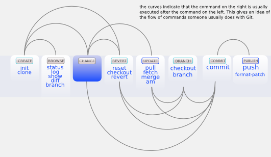
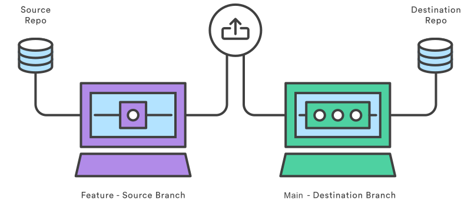
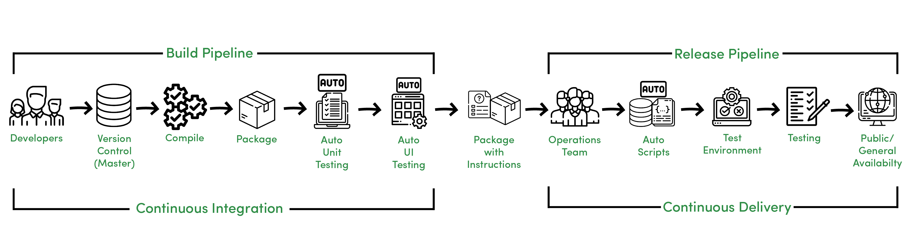
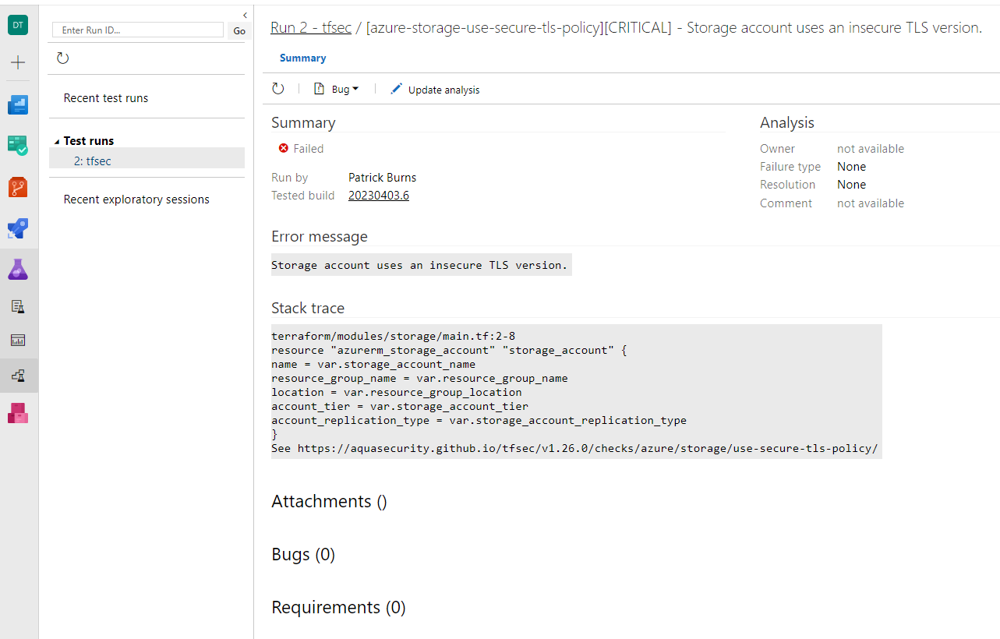
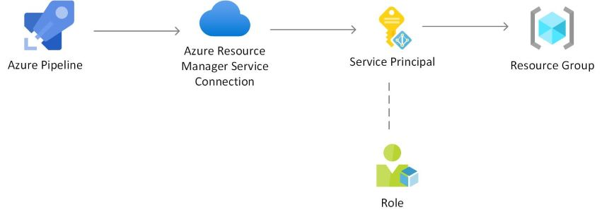
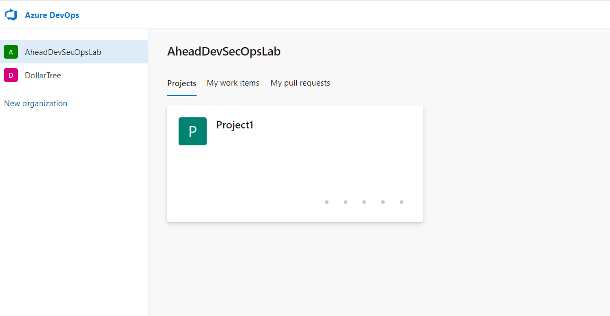
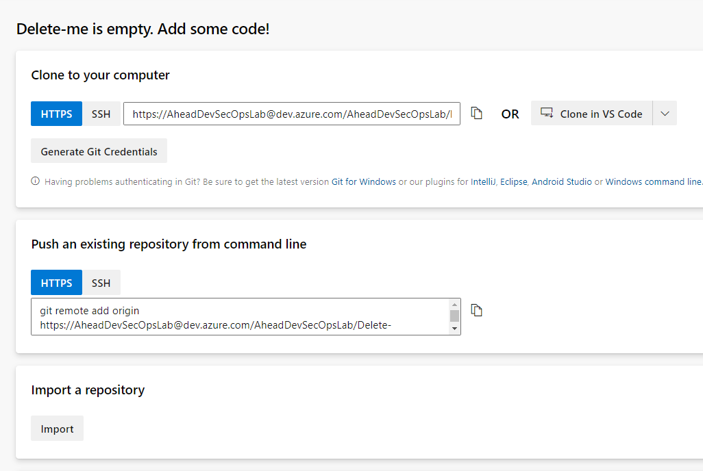
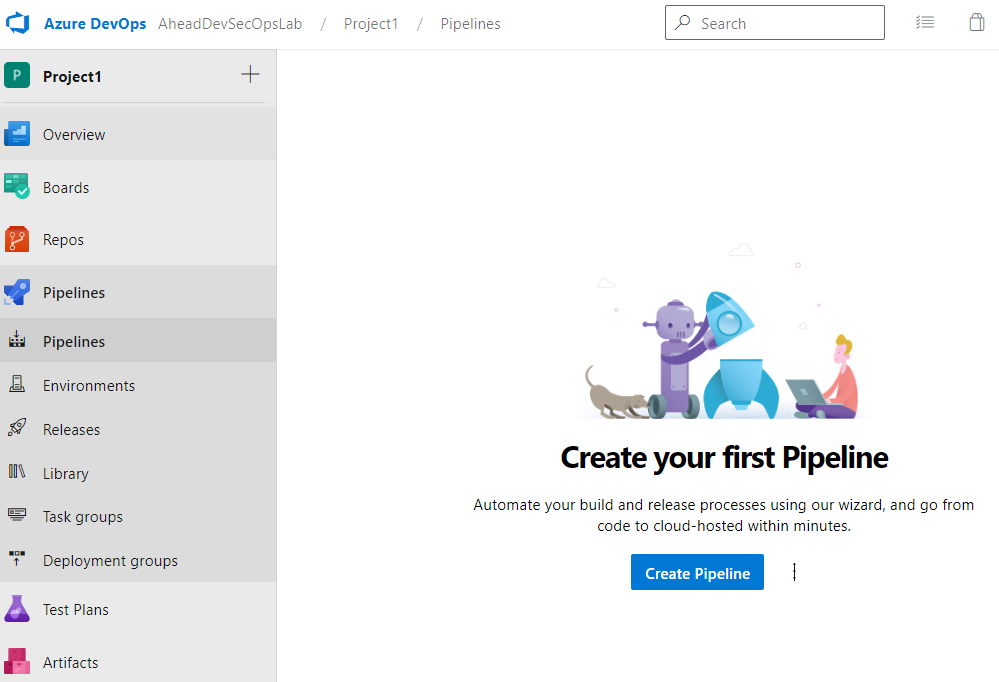
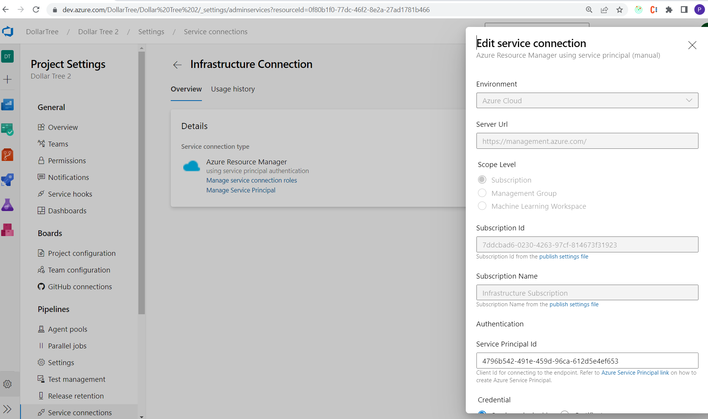

# CI/CD

**Goal:** Learn and implement the core concepts of CI/CD.

**Output:** An Azure DevOps pipeline defined through Terraform and configured in the Azure DevOps platform to automate deployments out to Azure.

## Tasks

1. [Install Git](https://git-scm.com/book/en/v2/Getting-Started-Installing-Git)
2. Manually deploy an Azure DevOps project and repository through Terraform to hold your individual work
3. Push your local code base to the repository in your newly created project using Git
4. Create a child module in the Terraform code for CICD
5. Define an Azure pipeline build definition through Terraform that will perform the necessary commands to deploy resources to Azure
6. Create a first YAML file for the pipeline to use
7. Manually deploy the pipeline via `terraform apply`
8. Verify that it is in the Pipelines section of your project in Azure DevOps
9. Configure a service connection in Azure DevOps using the Azure service principal associated with our subscription
10. Push code up to your repository that triggers your pipeline
11. Verify that the pipeline successfully runs and makes the expected updates to your Azure environment


# Core Module Concepts

## Git branching

Git branching is a feature of version control that allows multiple developers to work simultaneously on a code base. Branches can be created off the master branch to be worked on locally. Code changes are committed to these branches before being merged back to the master branch. 

### Git Core Concepts




- **Clone** Clone operation creates the instance of the repository. Clone operation not only checks out the working copy, but it also mirrors the complete repository. Users can perform many operations with this local repository. The only time networking gets involved is when the repository instances are being synchronized.  
  Command: ```git clone <URL>```  
- **Remote Vs Local** - Git has a core concept of there being a central remote repository and when you clone a repository then it will fully copied to a local directory.
- **Add** This will add a file, folder to the local repository and now under the control of git.  Files are not actually committed to the repository.  It does **not** commit the changes, it just lets git know that it should be tracking that file.  
Command: ```git add <filename>```  
- **Commit**   this will commit the changes to the working branch (normally local branch)  
Command: ```git commit -m <commit message>```  
- **Push** The push command will push your local repository changes (and commits) to the remote repository.  
Command: ```git push origin main```  
- **Branch** copy of an active branch at a moment in time.  It allows the developer to make changes directly to the branch without worries on impacting the main branch  


- **Pull Requests** Pull requests let you tell others about changes you've pushed to a branch in a repository on GitHub. Once a pull request is opened, you can discuss and review the potential changes with collaborators and add follow-up commits before your changes are merged into the base branch.



- **Tagging** - Git supports tagging to specific commits or pull requests.   it is recommended that you use [semantic versioning](https://semver.org/)
Semantic Versioning Follows the pattern:  

MAJOR.MINOR.PATCH (2.3.4)  

1) MAJOR version when you make incompatible API changes
2) MINOR version when you add functionality in a backwards compatible manner
3) PATCH version when you make backwards compatible bug fixes

### Forking Workflow

For the modules we will use the forking workflow.  We will utilize this workflow to give everyone the same starting point on each module. At the end of each module the person with the most mature code base will submit a pull request back out to the Project1 repo that everyone else will fork from to begin the next module.

For more details on the Forking workflow refer to [the previous module](../module1/Readme.md)
## CI/CD



### Continuous Integration

The purpose of continuous integration is to automate the building and integrating of custom code.   The goal is to make sure that the code that is being deployed is of the quality that we expect.  There are a couple core concepts:

- **Fail Fast** - the purpose of CI is to identify any issues as quickly as possible.
- **Enforce Standards** - This is the time to ensure that standards are met (linting, test coverage, complexity)
- **Quality Control** - Ensuring that quality meets the expected standards (unit testing, integration testing, linting)

Continuous integration is a practice used to keep a codebase stable by regularly committing code to a share repository using some form of version control. This allows conflicts and bugs to be caught as early as possible within the development lifecycle. Tools such as Azure DevOps can be used to automatically test, build and merge code upon commits.

## Continuous Delivery

The focus of continuous delivery is the automation of the deployment of features, applications, and infrastructure.  The focus of continuous deployment is on the deployment itself and ensure that deployment itself meets up to our standards of deployments.  There are a couple core concepts:

- **Environment Management**  - The CD portion of the pipeline can control deploying to the environments
- **Testing**  - The focus of testing is on the deployment itself, the non-functionals, and any E2E testing
- **Rollbacks** - Terraform itself does not "roll back", if you want roll back capabilities then it is up to the pipeline itself to rollback the release if needed.
- **Tagging** - Both Git and Docker (which we learn later) has the capability of tagging.  To ensure consistency, it is recommended to use the pipeline to use the pipeline to tag.
- **Automation** - It is normal to have manual stages in a deploy pipeline, that should be a business decision and not a technical one.   Everything should be automated.
- **Approval Gates** - Approval Gates are used to manually approve moving to the next step in a pipeline.
- **Release Gates** - Release Gates on gating agents in a pipeline where we are waiting for certain health criteria to be met (e.g. non-functional)
## Pipelines

A pipeline is a defined series of jobs that software goes through between development and deployment. It can be run manually or triggered by an event such as a completed pull request to the master branch. Pipelines execute tasks such as building, testing, linting, generating reports etc that are generally automated but can include manual tasks for approvals as well.

### Azure Pipeline Terms:

- Stage - a logical grouping of job(s)
- Job - a set of step(s) that run on a single agent
- Step - smallest building block of a pipeline. Either a script or pre-defined task
- Run - the execution of a pipeline
- Artifact - files or packages published by a run
- Agent - computing infrastructure that jobs run on

[Further Reading](https://learn.microsoft.com/en-us/azure/devops/pipelines/get-started/key-pipelines-concepts?view=azure-devops#job)

### Azure Manual Gates

Example of manual gates:

```
stage: terraform_apply
    dependsOn: [terraform_plan]
    condition: succeeded('terraform_plan')
    jobs:
    - deployment: terraform_apply
      continueOnError: false
      environment: 'approvalgates-production'
      timeoutInMinutes: 120
      strategy:
       runOnce:
        deploy:
            steps:
              - checkout: none
 
              - task: DownloadBuildArtifacts@0
                inputs:
                  artifactName: '$(Build.BuildId)-tfplan'
                  displayName: 'Download Plan Artifact'
```

### Pipeline Integrations

There are many integrations that can happen in the pipeline.  You can use the pipeline to ensure consistency and communication with downstream systems.

- [Service Now](https://marketplace.visualstudio.com/items?itemName=ms-vscs-rm.vss-services-servicenowchangerequestmanagement)

### Pipeline Triggers

Different pipelines can be triggered on different behaviors.   These behaviors could be:

- commits - any time that new commits come into git
- pull requests - any time that a new pull request is merged into the branch
- tags - on the creation of a new tag
- schedule - on a schedule
- create branch - Pipelines specific to a new branch getting created

For detail on the specific triggers in azure devops click [here](https://learn.microsoft.com/en-us/azure/devops/pipelines/build/triggers?view=azure-devops)

Example Trigger:

```
# specific branch build
trigger:
  branches:
    include:
    - master
    - releases/*
    exclude:
    - releases/old*
```

## YAML

YAML is a language often used in configuring pipelines. It is used to define a series of stages, steps and jobs that are to be executed when the pipeline is triggered.

Sample YAML code:

```
trigger:
- master

stages:
- stage: FirstBuild
  displayName: My First Build
  jobs:
  - job: FirstJob
    displayName: My First job
    steps:
    - script: echo Running first job
    - task: TerraformInstaller@0
      inputs:
        terraformVersion: latest
      displayName: 'Use Terraform Latest'

    - task: TerraformCLI@0
      displayName: 'Terraform Init'
      inputs:
        command: init
        workingDirectory: terraform
        backendType: azurerm
        backendServiceArm: 'ARM Connection'
```

## Testing & Security Scanning

### TFSec

Open source project that scans Terraform code to prevent security issues before before changes are made to infrastructure. It can be run locally or can be implemented as a task in your pipeline which will publish results to the Test Runs tab.

Example TFSec Error:



## Service Accounts To Perform Deployments

A service account or application account is a digital identity used by an application software or service to interact with other applications or the operating system. They are often used for machine to machine communication.

**Benefits Of A Service Account**
- Security - This allows us the ability to limit (and control) the exact permissions on the user who is deploying infrastructure.  
- Consistency - All deployments will be deployed and owned by the same user.
- Traceability - Makes auditing easier as deployments should be limited to that single user.

Azure Service Account Structure:



### Service Principals

A service principal is an identity that is configured with specific permissions that is used to authenticate apps and services in the cloud. They should follow the Principal of Least Privilege - restricting access to only what is necessary.

### Service Connections

A service connection is a mechanism for an application to "connect" directly to a service account and act on behalf of that user.  In the case of this module, we are going to need to create a service connection for Azure Devops to "connect" to Azure to manage the infrastructure and deploy resources.  For further reading go [here](https://learn.microsoft.com/en-us/azure/devops/pipelines/library/service-endpoints?view=azure-devops&tabs=yaml#common-service-connection-types).


## Pipeline Variables, Environment Variables, and Pipeline Secrets
Variables provide a way to make it easier to use a single pipeline, step, or task in many different contexts.   There are a couple different ways to do variables and your needs will drive which one you choose.
### Pipeline Variable.

A pipeline variable is a variable that is defined directly in your YAML pipeline and can be used by many steps in the pipeline.  The benefit here is that you will only need to define it once (at the top) and then you can use it throughout the entire pipeline.  If the value needs to change then you will change it in the pipeline definition and then all subsequent usages will update as well.

**Example:**
```
trigger:
- main

pool:
  # vmImage: 'windows-latest'
  vmImage: 'ubuntu-latest'

variables:
  solution: '**/*.sln'
  buildPlatform: 'Any CPU'
  buildConfiguration: 'Release'
  ASPNETCORE_ENVIRONMENT: 'Production'
  ```

  ### Environment Variable 
  The pipeline itself can also have it's own environment variables.  You can reference the environment variables directly from your pipeline.   Changing the value will change the pipeline behavior.   The benefit of this approach is that the actual variable values are controlled directly in your terraform scripts and not in your yamls.  This can be an easier way to manage the variables.  

  **Example Terraform Setting Environment Variable:**
  ```   
  variable {
    name = "AZDO_PERSONAL_ACCESS_TOKEN"
    secret_value = var.AZDO_PERSONAL_ACCESS_TOKEN
    is_secret = true
  }

  variable {
    name = "AZDO_ORG_SERVICE_URL"
    value = var.AZDO_ORG_SERVICE_URL
  }
  ```
   
  **Example Usage Of an Environment Variable in YAML:**
  ```
  $(AZDO_ORG_SERVICE_URL)
  ```

### Pipeline Secrets
Some variables are secrets (e.g. passwords, tokens) and it is **VERY IMPORTANT** that we do not store them in code and check them into GIT.  But the pipeline will often need access to these variables at run time.  The way to handle this is by creating a pipeline variable that is a secret and then leave the variable definition empty.  This way the environment value will be exposed to as few people as possible but the pipeline itself will have the ability to use it.

**Example Terraform defining a secret variable:**

```
variable AZDO_PERSONAL_ACCESS_TOKEN {}

  variable {
  name = "AZDO_PERSONAL_ACCESS_TOKEN"
  secret_value = var.AZDO_PERSONAL_ACCESS_TOKEN
  is_secret = true
}
```


# Module Step by Step

First, [install Git](https://git-scm.com/book/en/v2/Getting-Started-Installing-Git) if you do not have it installed.

We can use the master repository in Project1 as the starting point for this module. You can either clone the repo to your machine or use it as a guide while building out your own Terraform code.

We want to deploy an individual project and repository out to the Azure DevOps organization. This will best be done in a module in your Terraform code. Inside this module we will create a new main.tf file and a providers.tf file to configure the Azure DevOps provider. For guidance on configuring the Azure DevOps provider, look [here](https://registry.terraform.io/providers/microsoft/azuredevops/latest/docs). We will need to configure the environment variables for org_service_url and personal_access_token that are referenced in the "Argument Reference" portion of this documentation.

You can create a personal access token in the Azure DevOps platform by clicking into the "User Settings" icon toward the top right of your screen.

The org_service_url is the url to our root organization view in Azure devops: "https://dev.azure.com/AheadDevSecOpsLab/"

To set environment variables on a Mac, run this commands in your terminal:

`export [variablename]='value'`

Follow this [link](https://phoenixnap.com/kb/set-environment-variable-mac) for further reading on Mac environment variables.

On a windows machine, run this command:

`$env:[variablename]='value'`

To create our project and repository follow [Azure DevOps Project](https://registry.terraform.io/providers/microsoft/azuredevops/latest/docs/resources/project) and [Azure Devops Git Repository](https://registry.terraform.io/providers/microsoft/azuredevops/latest/docs/resources/git_repository) Terraform documentation for guidance on how to define the resource blocks used to create them in your new main.tf.

Verify that your project has been deployed out the organization by accessing it here alongside "Project 1":



We now want to push our local code base up to the master repository of the newly created project. Click into "Repos" and follow the instructions under "Push an existing repository from command line."

If you have cloned the repository from Project1 you will need to first run this command to remove the origin:  `git remote rm origin` to remove the connection to Project1.

If you have not cloned the master repository and are instead working in files you have created on your machine, we will first need to initialize a git repo in your working directory. This can be done via a `git init` command. Then, the files you have created will need to be added to git source control with a `git add *` command. This will add the files to "staging" and are ready to be committed with a `git commit -m "your commit message"`. Then, follow the remaining instructions under "Push an existing repository from command line" to push your repository out to your newly created repo.




Next, we want to create a pipelines module in the Terraform code and define a build definition.

This [Terraform Documentation](https://registry.terraform.io/providers/microsoft/azuredevops/latest/docs/resources/build_definition) is a good place to start defining your pipeline.

Next, a YAML file should be written defining the steps that the pipeline will perform. 

These steps can include 'terraform init,' 'terraform plan,' 'terraform apply' etc.

Once the pipeline build definition and YAML file are in place we can run a `terraform validate` and `terraform plan` before running a `terraform apply` to deploy the pipeline out to our Azure DevOps repo.

If the deployment succeeds we will be able to find the pipeline in the "Pipelines" section of our newly created project here:




In order for the newly created pipeline to authenticate to Azure we need to configure a service connection. The service connection page can be accessed in Project Settings. Everyone will use the service principal attached to our Azure subscription to create this service connection.





The service principal key and ID can be accessed in the Azure Portal key vault called "TestKeyVault0321"


Once the service connection has been created it can then be used in the pipeline to authenticate to Azure.


The following pipeline variables will need to be set for this configuration:

AZDO_ORG_SERVICE_URL\
AZDO_PERSONAL_ACCESS_TOKEN (**secret**)

**NOTE:** AZDO_PERSONAL_ACCESS_TOKEN should be marked as a "secret" and should never be checked into version control through the code.


[Link for troubleshooting](https://support.hashicorp.com/hc/en-us/articles/13737677728915-AzureAD-Error-403-Insufficient-privileges-with-Service-Principal) to troubleshooting attempts to create a service principal through terraform

# Additional Helpful Links

[Create an Azure Service Principal with the Azure CLI](https://learn.microsoft.com/en-us/cli/azure/create-an-azure-service-principal-azure-cli?toc=%2Fazure%2Fazure-resource-manager%2Ftoc.json&view=azure-cli-latest)\
[Azure Provider: Authenticating using a Service Principal with a Client Secret](https://registry.terraform.io/providers/hashicorp/azurerm/latest/docs/guides/service_principal_client_secret)\
[Azure Pipelines Terraform Tasks](https://marketplace.visualstudio.com/items?itemName=charleszipp.azure-pipelines-tasks-terraform)