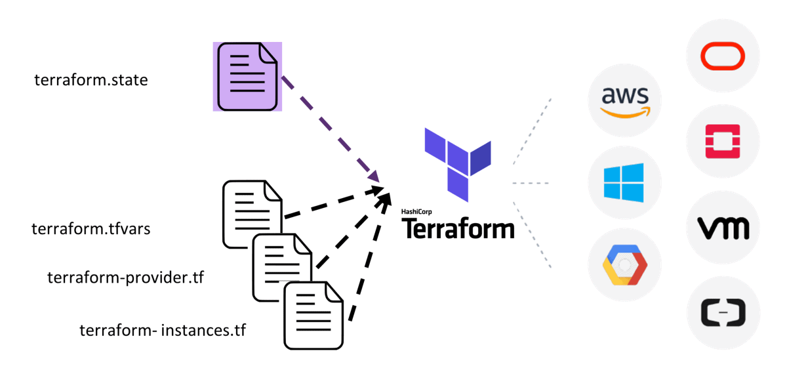
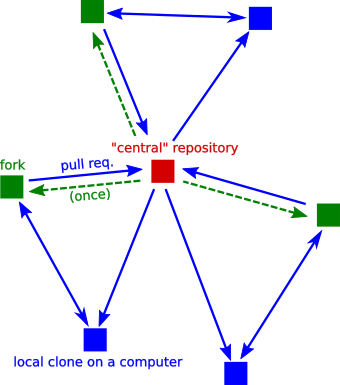
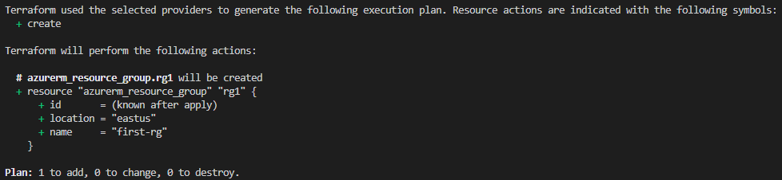

# Infrastructure as code

**Goal:** Learn and implement the core concepts of infrastructure as code.

**Output:** A functioning Azure environment created through Terraform.

## Tasks

1. Install Terraform, Azure CLI and a code editor (VSCode recommended)
2. Create an Azure storage account and blob container in a new resource group via the Azure CLI
3. Create a Terraform code base and configure the first providers.tf file (including the backend connection)
4. Build out the code base using variables, a root main.tf file and implement a modular structure for resources
5. (Do this throughout development) Experiment locally with the Terraform commands, authenticate to Azure via the cli and manually deploy

# Core Module Concepts

## Azure CLI 

The Azure CLI is a cross platform command line tool that allows you to execute commands inside of your azure resources.   It is essentially the command line version of the Console.   

Azure Commands typically follow the ```[noun] [noun] [verb]``` structure.

For example:

```az group create --name msdocs-azuresql-rg-$randomIdentifier --location "eastus" --tags rotate-storage-account-keys```  

In the above command:
- az == the command that bash will pickup to know what binary to call
- group == the "noun" or the "thing" that is going to be operated on by the CLI
- create == the "verb" or action that is going to take place on that "noun".  In this case it is creating a new group.
- The reamaining attributes are tags and metadata that will go on the resource.

In addition to single commands, the CLI can be used in a simple bash script.  For example:

```
# Rotate storage account keys

# Variables for storage
let "randomIdentifier=$RANDOM*$RANDOM"
location="East US"
resourceGroup="msdocs-azuresql-rg-$randomIdentifier"
tag="rotate-storage-account-keys"
storage="msdocsstorage$randomIdentifier"

# Create a resource group
echo "Creating $resourceGroup in $location..."
az group create --name $resourceGroup --location "$location" --tags $tag

# Create a general-purpose standard storage account
echo "Creating $storage..."
az storage account create --name $storage --resource-group $resourceGroup --location "$location" --sku Standard_RAGRS --encryption-services blob

# List the storage account access keys
az storage account keys list \
    --resource-group $resourceGroup \
    --account-name $storage 

# Renew (rotate) the PRIMARY access key
az storage account keys renew \
    --resource-group $resourceGroup \
    --account-name $storage \
    --key primary

# Renew (rotate) the SECONDARY access key
az storage account keys renew \
    --resource-group $resourceGroup \
    --account-name $storage \
    --key secondary
```


For lower level details on the Azure CLI [click here](https://learn.microsoft.com/en-us/cli/azure/what-is-azure-cli)  
For the list of available commands [click here](https://learn.microsoft.com/en-us/cli/azure/reference-index?view=azure-cli-latest)  
For the patterns governing how Azure CLI works [click here](https://github.com/Azure/azure-cli/blob/dev/doc/command_guidelines.md#general-patterns)  

### Anti-Patterns

There are some strong Anti-Patterns when it comes to the CLI (or the console).   

#### **1)  Using the CLI to modify the cloud environment**

Don't do it, it is easy to do it but it is a strong anti-pattern.   The CLI should be seen as a tool to query and READ items in the cloud environment not a way to manipulate the cloud environment.   The proper way to manipulate the environment will be through terraform using IAC.


#### **2)  Individual Users Having Administrator Access to the Console**

There should be very few owners of a subscription or resource group.   Prefer granting "read" access to users, be very judicous as to who can be a contributor.   RBAC Roles are the recommended way to manage user permissions in the Azure Environment.   

For environment changes, terraform will make these changes for you.

For lower level details on basic RBAC [click here](https://learn.microsoft.com/en-us/azure/role-based-access-control/built-in-roles)

**NOTE: Just because you have Administrator Access doesn't mean that you should use it.  Only grant full access to users who understand it is a last resort.**

## IaC

Infrastructure as code is a logical extension of the devops methodology as it will define and describe your infrastructure directly in code and then use common engineering tooling to promote, execute, and manage your environment.  

**Benefits** 
- **Faster deployments, development, and productivity** - Allowing pipelines to manage environments will accelerate the deployments.  Our jobs as engineers is to define the environment and trust the pipeline to deploy it.
- **Consistency** - This makes it very easy to keep consistency between environments and deployment strategies.
- **Financial Savings** - This helps to keep costs manageable instead of allowing every individual the capability to deploy an overly sized (expensive) resource
- **Less Human Error** - Many crashes and security breaches happen as a result of human error.  This minimizes that risk.

**Drawbacks**
- **Coupling to deploy tools** - for very cutting edge stuff it is often that there isn't a mechanism to deploy and the CLI is the only way.
- **Skills Gap** - not having the skills in house can make for a complicated IAC environment.
- **Mindset Shift** - Thinking in changes and declarative IAC is a mindset shift.   It is critical that the whole organization is aligned to it and not only some people.

### IAC Core Concepts ###
- **Declarative vs Imperative** - Most IAC languages will require you to either describe the state that you want (declarative) or declare the steps that you want the deployment to take (imperative)
- **Version control** - IAC will use coding tools to manage the environment.  Most often we will use GIT to manage the code and also a git workflow to manage code reviews and collaboration.   
- **CI/CD** - in addition to using git to house code, CI/CD pipelines will be used to promote changes through the environments.
- **Idempotence** - This is a critical concept in IAC.   The ability for a single operation to always produce the same result is critical.
- **Scalability** - Due to the ease of repeatability it is quite easy to scale out a solution via IAC.  This can happen by adding more modules or by adjusting scaling limits.
- **Immutable Infrastructure** - This is a critical concept.  You do not "change" a deployed artifact, you prefer to replace it.  The infrastructure is "immutable" and will be replaced with a new "immutable" artifact.


## Terraform
Terraform is a tool that allows you to manage both your on prem and cloud resources in a configuration language.   These configuration files can be reused, versioned, and shared.  It is intended to manage all aspects of your cloud infrastructure.  

[Terraform Overview](https://developer.hashicorp.com/terraform/intro)

<<<<<<< HEAD

=======

>>>>>>> 9e27182cbc84c8d918c630a60a5d40cf6462b449


**Drawbacks**
- **Provider Limitations** - we are beholden to waiting for terraform to support newer api features or products.   This typically only involves the most advanced features but it is a limitation.
- **HCL is a strange language** - Due to reserved words and trying to fit logic in json it can be a bit of an illogical language.  Once you learn it then it isn't that bad but not my favorite.
- **State is awkward and makes drift possible** - Terraform Stores State and that is how it "knows" about it's environment.  I predict that a future feature of terraform will get rid of state and instead it will query the actual state.
- **Versions of Terraform** - Terraform can be a bit less backwards compatable then I would like.  This can create coupling to specific versions.
- **Rollbacks aren't really a thing** - Terraform would call this a feature but this is a mindset shift.   If something does go wrong in your deploy then it will **not** rollback by default.   You will need to use Semantic Versioning in your code and re-run terraform to that version of the code.

### Core Terraform Concepts ###
- **HCL (Hashicorp Configuration Language)** - This is the configuration language that terraform uses to make changes to the environment.  For an overview of the language [click here](https://developer.hashicorp.com/terraform/language)
- **Providers** - These are plugins to terraform that will provide you access to their apis (e.g. Azure, GCP, Kubernetes, etc).  Without the provider then you don't have the ability to manage those resources.   They are also versioned independently and often you want to couple to a specific version.  
  - For more detail on providers [click here](https://developer.hashicorp.com/terraform/language/providers).   
  - For the list of available providers [click here](https://registry.terraform.io/browse/providers)
- **State (terraform.tfstate)** - The state file is a file that tells terraform what is currently in the environment.  It is a human readable JSON but it is **assumed** to be accurate to the current environment. 
    - Storage Location - By default the state file is stored where the terraform script is run.  This is unrealistic to a cloud implementation.  Typically, this will be stored in a remote cloud bucket. 
- **Terraform Commands** - There are many commands in terraform that can be run from the CLI.  For the full list [click here](https://developer.hashicorp.com/terraform/cli/commands)
    - Init - This command will pull the latest providers to your terraform instance and ensure that it can read the state file.  
  ```terraform init```
    - Validate - Basic command to validate your syntax and show you errors.   You can also (recommended) add a plugin to your IDE (e.g. vscode) to do the same thing.  
  ```terraform validate```
    - Plan - Will evaluate the configuration file up against the state file and determine the changes that will be applied.   This doesn't make changes, it will just show you the changes if you were to apply.  
    **Note** - It is very common that you output your plan to a file to be interpreted by a later step in a pipeline.  
  ```terraform plan```
    - Apply - This is the command that will actually apply the changes to the cloud environment.  
  ```terraform apply```
    - Destroy - This command will destroy the terraform infrastructure that is defined in the terraform module  
  ```terraform destroy```


### Anti-Patterns

There are some strong Anti-Patterns when it comes to Terraform (or the console).   Terraform posts their own anti-patterns and they are well documented.  It is encouraged that you read [here](https://www.hashicorp.com/resources/opinionated-terraform-best-practices-and-anti-patterns) to get up to speed.  I wanted to call out a couple critical ones:

#### **1)  Modifying the terraformed environment outside of terraform**
Might be stating the obvious here but a partially terraformed environment will not work.  Terraform expects the state file to be correct.
#### **2)  Running the Terraform Import Command**
If you end up with state drift then you can import resources into your state.  It works but if you find yourself doing it often then it is a good idea to ask why.  Something is going wrong that is creating state drift.

### **3)  Storing Secrets in Variables** 
Since code is checked in, it is critical that secrets are not stored in code and will be prompted at run time.  

### **4)  Monolithic Terraform Scripts**
Monolithic terraform scripts create bottlenecks and any issues can hold up all deploys in future scripts.

## Forking Workflow
We are going to use the forking workflow on all of these modules.  That way if you miss a module or don't get caught up then you can start with a fresh new "fork".  

For further details on the forking git workflow then go [here](https://flatironinstitute.github.io/sciware-git-collaborative/03-distributed/)



&nbsp;


# Module Step by Step

First, installations:

[Azure CLI](https://learn.microsoft.com/en-us/cli/azure/install-azure-cli)

[Terraform](https://developer.hashicorp.com/terraform/tutorials/aws-get-started/install-cli)

[VSCode](https://code.visualstudio.com/download) (or code editor of your choice)

After the Terraform download is unzipped, we need to add the location to the Path of your user environment variables.

Run a `terraform --version` command to ensure that it is correctly installed.

The next thing to do is create an Azure Storage Account to hold the Terraform state. [This link](https://learn.microsoft.com/en-us/azure/developer/terraform/store-state-in-azure-storage?tabs=azure-cli) provides step by step instructions on how to create the storage account via the Azure CLI. 

**NOTE** that step 3 "Configure terraform backend state" is to be done in your Terraform code. Use this link [First Terraform Project](https://learn.microsoft.com/en-us/azure/developer/terraform/create-resource-group?tabs=azure-cli) to follow along on how to configure your provider with the 'backend' code block and then continue building out the initial code base. 

The first file to put into place is the providers.tf file. It will hold a reference to `hashicorp/azurerm` as a required provider since we are working with Azure. The second piece is to configure the "backend" code block. The backend defines where the Terraform state will be stored and should be configured to match the storage account we just created. Run a `terraform init` command to validate that your configuration is valid. This will create a `.terraform` folder in your working directory.

Once your provider is configured, we can create our first main.tf file in which we will declare an empty resource group to deploy with Terraform.

We use a resource block of code to define what we want Terraform to deploy:

```
resource "PROVIDER_TYPE" "LOCALNAME {

}
```

In our case, "Provider" will be "azurerm" and "Type" refers to the resource we are defining  -  in our case "resource_group"

Inside the "resource" code block we will then configure the arguments required to create that specific resource. In the case of a resource group, we only need to specify a name and location. Here is what your code might look like.

```
resource "azurerm_resource_group" "rg1" {
  name = "first-rg"
  location = "eastus"
}
```

See Terraform's [documentation](https://registry.terraform.io/providers/hashicorp/azurerm/latest/docs/resources/resource_group) for creating a resource group.

After this resource group is declared in your main.tf file we can run a `terraform validate` command to ensure our syntax ais correct.

Next, run a `terraform plan` command. This will give us a preview of what will happen before running a `terraform apply` which would actually perform a deployment.

The output of the `terraform plan` will compare what we have declared in our Terraform code base to what is currently deployed in the cloud and held in the Terraform state.  At this point, we have not yet deployed anything and our state file is empty. The compiler will notice that we have declared a new resource group and the output will look something like this:



Finally, running a `terraform apply` will actually execute the deployment. Run this and then navigate to the [Azure Portal](portal.azure.com) to view your newly created resource-group.

## Further Steps

As part of our base Terraform code we will want to create a modular structure. The root will have a main.tf, a configured provider, variables and a tfvars file to pass in values. There should be a parent/child structure between the root and child modules, each child having a main.tf, provider (if necessary) and variable declarations of their own. Begin with just one main.tf file and then we can add in the child modules for logical groupings (e.g. resource groups, networking, events, pipelines etc.).

Here is a simple example of what your initial file structure should look like:


Note: Before making any deployments via 'terraform apply' we will need to authenticate to Azure via an 'az login' command in the cli.  

# Day 1 Observations

1. Need to install a code editor if you don't already use one (VSCode recommended).
2. There seem to be network issues if you are working at the office or on the VPN when trying to perform installs.
3. Make sure to add an environment variable pointing to the Terraform download.
4. If there are issues running `az login` a workaround can be to copy the url of the browser that gets opened and paste that into a private/incognito window.
5. When creating a storage account unique naming must be used to differentiate from your peers.

# Additional Helpful links

## Azure Links
[Azure CLI Overview](https://learn.microsoft.com/en-us/cli/azure/what-is-azure-cli)  
[Installing Azure CLI](https://learn.microsoft.com/en-us/cli/azure/install-azure-cli)  
[Azure CLI Patterns](https://github.com/Azure/azure-cli/blob/dev/doc/command_guidelines.md#general-patterns) 
[First Terraform Project](https://learn.microsoft.com/en-us/azure/developer/terraform/create-resource-group?tabs=azure-cli)

## Git Workflow Links
[Forking Workflow Explained](https://flatironinstitute.github.io/sciware-git-collaborative/03-distributed/)  

## Terraform Links
[Terraform Overview](https://developer.hashicorp.com/terraform/intro)  
[Terraform Commands](https://developer.hashicorp.com/terraform/cli/commands)  
[Terraform Azure Provider](https://registry.terraform.io/providers/hashicorp/azurerm/latest/docs)  
[Terraform on Azure](https://learn.microsoft.com/en-us/azure/developer/terraform/)  
[Installing Terraform](https://developer.hashicorp.com/terraform/tutorials/aws-get-started/install-cli)  
[Terraform Providers](https://registry.terraform.io/browse/providers)  
[Terraform variables](https://developer.hashicorp.com/terraform/language/values/variables)  
[Terraform tfvars](https://spacelift.io/blog/terraform-tfvars)

