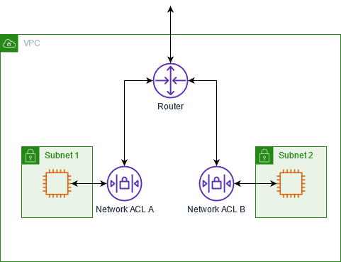

# Networking, Policy and Cloud Management Hierarchy

Goal: Understand the basics of networking, policy and cloud management hierarchy.

Output: Use Terraform and the pipeline created in module 2 to deploy a base networking zone comprised of a virtual network, subnets, a security group, a firewall, a load balancer and a network interface

# Tasks

1. Pull the master code repository or use it as a guide to get your Terraform code up to date with a working pipeline
2. Create a Terraform module for networks that is declared in the root main.tf
3. Insert a main.tf and variables.tf in the network module to pass values and begin creating network-related resources
4. In the main.tf file, use Terraform's azurerm resource documentation to create the following resources:
   1. Virtual network 
   2. Subnet(s)
   3. Network Interface
   4. Public IP
   5. Load Balancer
   6. Network Security Group
5. Continually run `terraform validate` and `terraform plan` to test your work
6. Commit this code out to your master branch to trigger the pipeline to deploy the resources
7. Experiment with the newly created networking resources, ip addresses etc


## Cloud Networking Core Concepts


### **Virtual Networks/Virtual Private Cloud: (VPC)** 
networks hosted in the cloud that can be connected to other virtual or on-prem networks.  In a cloud the VPC is typically a "global resource", meaning that they can be accessed/used by any resource in your environment regardless of what region or zone it resides within. 

A VPC has a couple roles and responsibilities:

- **VM Image Connectivity** - Whether you are running containerized solutions or not the backbone of your compute will be VMImages.   Your VPC will facilitate communication.
- **Load Balancing** - Will provide load balancing for ingress and egress points to your VPC.
- **Connecting Networks** - Will facilitate connection from Virtual Network to On-Prem Network

### **Subnets:** 
Owned by a VPC, and will have a set of IP addresses (range) that can be used within the VPC.   


Types: 
- **IPv4** Limits the subnet to IPV 4 only
- **IPv6 and IPv4** - supports both IP ranges

### **Access Control Lists (ACL)/Routing Table** 
Will control the network traffic to the specific subnets in your VPC.  It does this by specifying rules, these rules are numbered and the lowest number rules are applied first.

- **Rule number**. Rules are evaluated starting with the lowest numbered rule. As soon as a rule matches traffic, it's applied regardless of any higher-numbered rule that might contradict it.
- **Type** The type of traffic; for example, SSH. You can also specify all traffic or a custom range.
- **Protocol** You can specify any protocol that has a standard protocol number. For more information, see Protocol Numbers. If you specify ICMP as the protocol, you can specify any or all of the ICMP types and codes.
- **Port range** The listening port or port range for the traffic. For example, 80 for HTTP traffic.
- **Source** [Inbound rules only] The source of the traffic (CIDR range).
- **Destination** [Outbound rules only] The destination for the traffic (CIDR range).
- **Allow/Deny** Whether to allow or deny the specified traffic.



To learn more about ACLs click [here](https://docs.aws.amazon.com/vpc/latest/userguide/vpc-network-acls.html)

### **Traffic Manager**  
It is possible (recommended) to have multi region deployments for environments that have to have the highest of both performance and availability.  This allows network traffic to be routed to the healthiest and closest region.  


### **Load Balancers** distribute inbound traffic amongst resources in a virtual network.  Almost all LB in the cloud are software load balancers.  At the highest level the load balancers serve 3 main purposes:

1)  Endpoint Discovery - Will listen for new servers coming on the network
2)  Health Checking - Ping Checks on the server
3)  Load Balancing - Round Robin, Load, Sticky sessions, etc

There are two types of load balancers in most cloud environments:

1)  Internal Load Balancer - this is a load balancer that is assigned to a subnet and will have private IP's.  This will be used for load balancing between different tiers or layers of an application.


2)  External Load Balancer (AKA Classic) 


### **Security Groups:** 
A security Group allows the control of traffic to and from resources in a virtual network.  Just because something is in the same network doesn't mean that they are allowed to talk to one another.   The Security Group will control which resources can talk to which resources and how they can communicate.  


### **Cloud Firewall:** - 
A mechanism to filter out any malicious network activity.  They will typically form a virtual barrier around some infrastructure, applications, or a subnet. Just like a normal firewall, you can set rules on what kind of traffic you can allow or not allow in your firewall.

```
gcloud compute firewall-rules create RULE_NAME \
    --action=ALLOW \
    --direction=INGRESS \
    --network=NETWORK \
    --priority=1000 \
    --rules=ICMP_PROTOCOL \
    --source-ranges=RANGES_OUTSIDE_VPC_NETWORK
```

#### Differences Between a Firewall and a Security Group
There is some similarities between a firewall and a security group as they are both allowing or not allowing traffic to specific areas of your network.   There are a couple core distinctions on when to use one over the other:
- **SGs are Cheaper** - security groups will be cheaper in the long run
- **SGs are setup to be more granular** - Typically security groups are used to connect individual applications (or restrict) them from connecting to each other
- **Overusing Firewalls Creates Complexity** - Having to put in a firewall rules for every single connection between applications will become cumbersome.  This will make your firewall rules very complex.  
- **Firewalls work on IPs where SG's tend to restrict by application** - It is generally best practice to not know the IP addresses of your applications and having to put IP filtering on applications will get difficult.
- **Prefer Firewalls on Ingress and Egress points** - Due to ease of alerting, logging, and tracing I find it best to use firewalls for ingress points into your network and security groups when communicating between subnets 
- **Firewalls have a higher glass ceiling** - Firewalls allow for more complex rules (e.g. FQDN Rules, URL Filtering, TLS inspection)
- **Prefer Security Groups on the Instance Level** - if you are allowing connections between two instances of a resource then a security group tends to be the correct decision


### **On Prem to Cloud Connections** 
This will allow for secure connections between an on prem and virtual networks.  There are two main ways to connect your internal Network with VPC.  Choosing the right connection type for you is critical.

1)  Site to Site VPN - This will encrypt all traffic from your VPC directly to your internal data center.   It is typically very easy to install
    - **Pros:** Simplicity, Cost, Pricing
    - **Cons:** Lower Glass Ceiling, Less Secure as traffic goes to the external Internet, Slower
2)  Direct Connection (A.K.A Express Route, Dedicated Interconnect) - A direct connection directly from your VPC to your internal network
    - **Pros** More Consistent Experience as it isn't going to the external network, Faster, more scalable
    - **Cons** Not Highly Available by default, More complicated to setup, More expensive


## Patterns and Anti-Patterns

There are actually a million patterns and anti-patterns for cloud networking and this one module cannot cover them all.   Here are a couple links to help you if you want to go deeper.

[Cloud Networking Best Practices](https://www.iansresearch.com/resources/all-blogs/post/security-blog/2021/07/13/best-practices-for-network-segmentation-in-the-cloud)
[Security Best Practices](https://www.esecurityplanet.com/cloud/cloud-security-best-practices/)

### Networks are NOT Security
This does not mean that you should build "insecure" networks but it is encouraged to not think of networks as providing a level of security to your cloud environments.  
### Favor Hub and Spoke Model
Hub and Spoke pattern is a very common pattern when it comes to network connectivity (and even applications).   Having consistency in this pattern will ensure ease of management.

There are a couple benefits of this:
- Less Ingress Points
- Easier to Isolate workloads through subnets
- Easier to enforce standards


For more details on the hub and spoke click [here](https://learn.microsoft.com/en-us/azure/cloud-adoption-framework/migrate/azure-best-practices/migrate-best-practices-networking)

### Subnets Provide Isolation
I typically group subnets based on the business needs (e.g. applications deployed) and the layers of the application (e.g. data vs UI)

### Use IAC for deployments
Probably goes without saying but your network is part of your application, there is no distinction between the two.  Use IAC to deploy your networks so that it will be consistent throughout environments.

### Understand The Shared Responsibility Model
When you decide to do cloud then the cloud provider of choice (Azure and GCP) are assuming some responsibility around availability, security, and standards.  Knowing exactly what you are in charge of and what your provider is in charge of is important in making the right security decisions.


# Osi Model


# Azure specific concepts that were called out in the Cloud Current State workshops

## Azure Application Gateway

- Load balancer for web traffic that operates at the application layer as opposed to the transport layer
- Can make decisions based on HTTP request attributes and perform URL-based routing

## ExpressRoute

- Allows for the extension of on prem networks to Azure via a private connection

## Azure Virtual WAN (Wide Area Network)


# Policy
Policy is used to establish guidelines, rules and conventions for cloud resources that ensure they are used in compliant, secure and efficient manners. Some categories of policy include:

### Security
- Access & Identity management
- Data protection
- Network security

### Operations
- Disaster recovery
- Change management
- Cost regulation
- Incident response

### Compliance
- Following industry standards and adhering to laws/regulations
- SOC reporting, data privacy etc.

# Policy as Code

Enforcing policy through code has a number of benefits:

- Efficiently applying policy at scale
- Discover non-compliant early on in SDLC
- Reduces errors generated by manual checks
- Version control
- Repeatable
- Standardization


## Policy Structure
It is a good idea to have your policies in a logical structure that makes sense. Here is an example of how policies are often setup.


## Example Tagging Policy

Below is an example policy showing how you can enforce that the proper tags are put on your resource groups within your environments.

```
resource "azurerm_policy_definition" "addTagToRG" {
  count        = "${length(var.tag_list)}"
  name         = "addTagToRG-${var.tag_list[count.index]}"
  policy_type  = "Custom"
  mode         = "All"
  display_name = "${var.tag_list[count.index]} Tag to resource group"
  description  = "This policy will make it mandatory for the user to add specified tags whenever creating a Resource Group."
  metadata = <<METADATA
    {
    "category": "General",
    "version" : "1.0.0"
    }
  METADATA
  policy_rule = <<POLICY_RULE
  {
      "if": {
        "allof": [
          {
            "field": "[concat('tags[', parameters('tagName'), ']')]",
            "exists": "false"
          },
          {
            "field": "type",
            "equals": "Microsoft.Resources/subscriptions/resourceGroups"
          }
        ]
      },
      "then": {
        "effect": "deny"
      }
    }
  POLICY_RULE
parameters = <<PARAMETERS
    {
        "tagName": {
          "type": "String",
          "metadata": {
            "displayName": "Mandatory Tag ${var.tag_list[count.index]}",
            "description": "Name of the tag, such as ${var.tag_list[count.index]}"
          },
          "defaultValue": "${var.tag_list[count.index]}"
        }
}
PARAMETERS
}
```


# Cloud Hierarchy

A defined structure that organizes cloud resources, perform access control and enforce policies and standards.

# Azure Hierarchy


**Management groups:** Allows you to manage access, policy, and compliance for multiple subscriptions.   
**Subscription:** a way to logically associate user accounts with the resources that they create.   It allows you the capability of setting resource limits and quotas on the resources that you can create and use.
**Resource Groups** - logical groupings where you can deploy resources into.  Often times the resource groups are grouped by application stack specific (e.g. database, storage, UI, etc)
**Resources** - Are instances of services that you can create (e.g. virtual machines, storage)

For lower level details on azure hierarchy click [here](https://learn.microsoft.com/en-us/azure/cloud-adoption-framework/ready/azure-setup-guide/organize-resources)

## Example Hierarchy


## Policies and RBAC

- **Policies** - Policies help to enforce organizational standards and ensure compliance at scale.   Policies can be applied at a subscription, resource group, or even resource level.
- **RBAC** - Role Based Access Control will enforce rules on behavior that a user can perform in a cloud environment.

At it's simplest form, a policy ensures that what is being deployed looks correct and meets your standards.  Your RBAC will ensure that the action that the user is attempting to do is allowed.

## Policy Example

```
resource "azurerm_policy_definition" "policy" {
  name         = "accTestPolicy"
  policy_type  = "Custom"
  mode         = "Indexed"
  display_name = "acceptance test policy definition"

  metadata = <<METADATA
    {
    "category": "General"
    }

METADATA


  policy_rule = <<POLICY_RULE
 {
    "if": {
      "not": {
        "field": "location",
        "in": "[parameters('allowedLocations')]"
      }
    },
    "then": {
      "effect": "audit"
    }
  }
POLICY_RULE


  parameters = <<PARAMETERS
 {
    "allowedLocations": {
      "type": "Array",
      "metadata": {
        "description": "The list of allowed locations for resources.",
        "displayName": "Allowed locations",
        "strongType": "location"
      }
    }
  }
PARAMETERS

}
```


## RBAC 


```
data "azurerm_subscription" "primary" {
}

data "azurerm_client_config" "example" {
}

resource "azurerm_role_definition" "example" {
  role_definition_id = "00000000-0000-0000-0000-000000000000"
  name               = "my-custom-role-definition"
  scope              = data.azurerm_subscription.primary.id

  permissions {
    actions     = ["Microsoft.Resources/subscriptions/resourceGroups/read"]
    not_actions = []
  }

  assignable_scopes = [
    data.azurerm_subscription.primary.id,
  ]
}

resource "azurerm_role_assignment" "example" {
  name               = "00000000-0000-0000-0000-000000000000"
  scope              = data.azurerm_subscription.primary.id
  role_definition_id = azurerm_role_definition.example.role_definition_resource_id
  principal_id       = data.azurerm_client_config.example.object_id
}
```


# Additional Helpful Links

[Azure Policy Compliance task](https://learn.microsoft.com/en-us/azure/devops/pipelines/tasks/reference/azure-policy-check-gate-v0?view=azure-pipelines)

[Azure Policy built-in definitions](https://learn.microsoft.com/en-us/azure/governance/policy/samples/built-in-policies)

[Create a policy assignment using Terraform](https://learn.microsoft.com/en-us/azure/governance/policy/assign-policy-terraform)