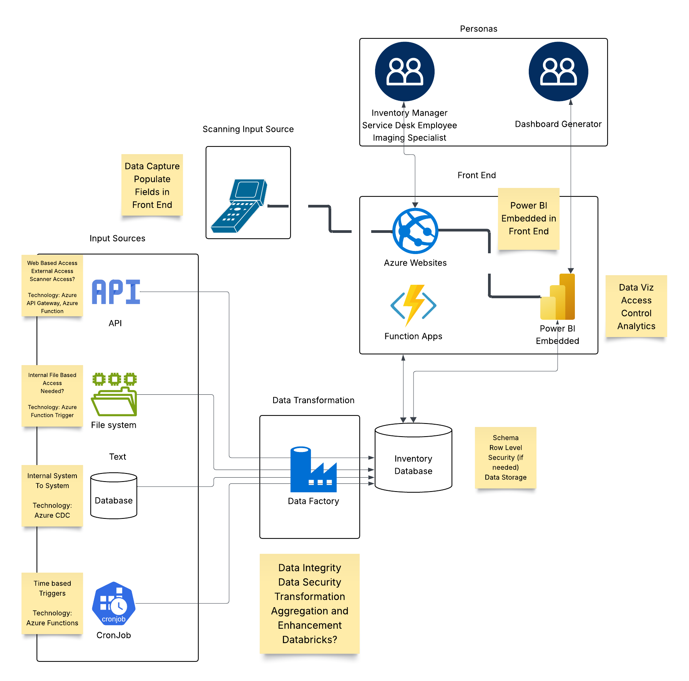

# Cloud-Native Data Intake Patterns: Best Practices for Azure

## Agenda

- Solution Overview
- Key Terminology
- Infrastructure as Code
- CI/CD
- Alerting
- Networking

## Solution Overview

## Key Terminology

**Cloud Resources:** refer to computing resources that are provided through a service provider (Azure, AWS, GCP,etc) over the internet. Examples include:
- virtual machines
- virtual networks
- cloud databases
- firewalls
- monitoring tools

**Resource group:** a logical grouping of related cloud resources. Permissions and policies can be applied at the resource group level that are applied to all resources in the group.

**Git:** A version control system used to track code changes that enables collaboration among developers. 

**Git repository:** A structure of folders (or directories) and files that stores the code and all previous versions of it. To work on the repository it is common practice to clone the repository to your local machine and make changes on a branch that can be merged back to the master branch of the repository.

**VSCode:** One example of a code editor that developers use to work on code in their local repository. It offers support for numerous programming languages and can be configured with extensions and keyboard shortcuts specific to your project.

**Terraform:** Tool that allows you to manage both your on prem and cloud resources in a configuration language. These configuration files can be reused, versioned, and shared.  It is intended to manage all aspects of your cloud infrastructure. 

**Terraform Remote State:** JSON file that contains the current configuration of cloud resources and any dependencies between resources. The state file can be stored locally but best practice is to store the state remotely so it can be accessed by multiple machines.

**Azure DevOps:** Platform that offers tools for project management, code version control, CI/CD pipelines etc. 

**Pipeline:** A defined series of jobs that software goes through between development and deployment. It can be run manually or triggered by an event such as a completed pull request to the master branch. Pipelines execute tasks such as building, testing, linting, generating reports etc that are generally automated but can include manual tasks for approvals as well.

[Glossary of Azure Specific Terminology](https://learn.microsoft.com/en-us/azure/azure-glossary-cloud-terminology)

**NOTE: We recommend digesting the [Cloud Adoption Framework](https://learn.microsoft.com/en-us/azure/cloud-adoption-framework/) published by microsoft.  This has much deeper dives into all components of a Azure Environment and is kept up to date as features are released**  

## Infrastructure as Code

[IAC](IAC/Readme.md)

## CI/CD

[CICD](CICD/Readme.md)

## Alerting

[Alerting](Alerting/Readme.md)

## Networking

[Networking](Networking/Readme.md)

## Specific Modules for Proposed Archiecture

[Specific Modules for Proposed Archiecture](solution-arch-components.md)
