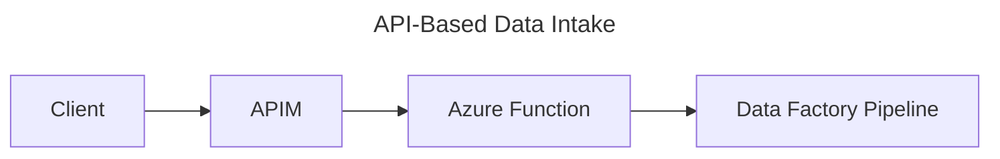

# API-Based Data Intake Pattern

## 📝 Overview
API-based ingestion involves collecting data from internal or external systems via HTTP APIs.

## 🧱 Core Azure Components
- **Azure API Management (APIM)**: For securing and managing API access
- **Azure Functions**: Lightweight compute for processing API payloads
- **Azure Data Factory**: For orchestrating ETL processing of ingested data

## 🔁 Architecture Flow

## ✅ Use Cases
- Ingesting data from SaaS platforms
- Internal microservices providing data snapshots
- Webhook-based event ingestion

## ⭐ Best Practices
- Use APIM for authentication (OAuth2, Managed Identity)
- Design Azure Functions to be stateless and idempotent
- Log telemetry with Application Insights
- Handle retries and rate limiting gracefully

## ⚠️ Considerations
- API rate limits and throttling
- API schema/version changes
- Secure storage of API keys or secrets (Key Vault)

## 🚀 Implementation Steps
1. Define API contract (OpenAPI spec)
2. Create and deploy Azure Function
3. Configure APIM with policies
4. Trigger ADF pipeline from function or blob
5. Monitor and alert on failures