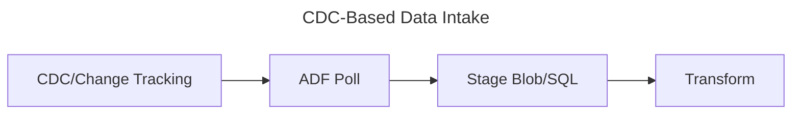

# Database CDC-Based Data Intake Pattern

## 📝 Overview
Uses Change Data Capture to ingest only modified rows from a source database.

## 🧱 Core Azure Components
- **Azure SQL Database or SQL Managed Instance**
- **Self-hosted Integration Runtime** (for on-prem SQL)
- **Azure Data Factory Mapping Data Flows**

## 🔁 Architecture Flow

## ✅ Use Cases
- Near-real-time sync between systems
- Data warehousing or reporting
- Auditing and data lineage tracking

## ⭐ Best Practices
- Enable CDC or Change Tracking selectively
- Use partitioning and watermarks to track state
- Regularly clean up CDC logs
- Monitor ADF run history for drift

## ⚠️ Considerations
- Schema evolution requires pipeline updates
- Volume of change data may vary
- Latency vs. performance tradeoffs

## 🚀 Implementation Steps
1. Enable CDC on target tables
2. Set up linked service to SQL DB
3. Design incremental ADF pipeline
4. Test pipeline with sample data
5. Schedule and monitor execution
