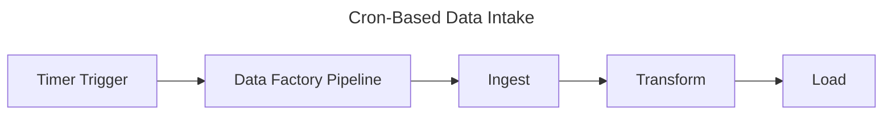

# Cron-Based Task Data Intake Pattern

## 📝 Overview
Data ingestion that runs on a scheduled basis (e.g., daily, hourly).

## 🧱 Core Azure Components
- **Azure Data Factory**: Scheduled triggers and pipeline orchestration
- **Azure Logic Apps or Functions** (optional orchestration layer)

## 🔁 Architecture Flow

## ✅ Use Cases
- Daily batch data loads
- API syncs where no webhook is available
- Scheduled reports or jobs

## ⭐ Best Practices
- Use UTC time for scheduling
- Parameterize pipeline for reusability
- Alert on failures with Azure Monitor
- Document and audit schedule definitions

## ⚠️ Considerations
- Overlapping pipeline runs
- Time zone issues with external systems
- Load balancing during business hours

## 🚀 Implementation Steps
1. Create ADF pipeline with parameters
2. Define scheduled trigger (cron expression)
3. Validate trigger behavior in dev environment
4. Set up logging and alerts
5. Promote to test and prod environments