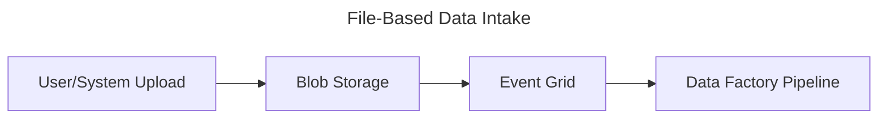

# File-Based Data Intake Pattern

## 📝 Overview
Triggered when files (CSV, JSON, Excel) are uploaded by internal systems or users.

## 🧱 Core Azure Components
- **Azure Blob Storage / ADLS Gen2**: File drop location
- **Azure Event Grid**: For event-driven pipeline triggers
- **Azure Data Factory**: For ingestion and transformation

## 🔁 Architecture Flow

## ✅ Use Cases
- Uploads from finance or HR systems
- Exported reports from on-prem tools
- One-time data migration files

## ⭐ Best Practices
- Enforce folder and file naming standards
- Stage files before final ingestion
- Archive files after processing
- Validate schema before transform

## ⚠️ Considerations
- Duplicate file handling
- Missing or malformed data
- Long-running file transfers

## 🚀 Implementation Steps
1. Create Blob container and set permissions
2. Enable Event Grid for blob events
3. Design ADF pipeline to process file
4. Configure trigger on blob path
5. Set up alerting and error handling